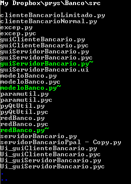

# wls
The popular command-line unix tool, ported to Windows.

The command-line tool *ls* is a popular way to show the files inside a directory in Unix.

Available parameters:

    -a: view also hidden files
    -l: long listing format
    -R: recurse subdirectories
    -A: view also hidden files, but ignore . and ..
    -d: only show directories
    -B: ignore backups
    -1: simple - one directory entry per line
    -C: wide directory listing

    --no-colors     Avoid the use of colors.
    --version       Shows version and exits.
    --verbose       Shows program title before directory listing.
    --help          Shows this help and exits.

[Download last release](https://github.com/Baltasarq/wls/releases "Release").
[Show](https://github.com/Baltasarq/wls/ "wls in GitHub") in [GitHub](https://www.github.com/ "GitHub").
&copy; 2009 [baltasarq](http://baltasarq.info/ "baltasarq home") [MIT License](http://www.opensource.org/licenses/MIT "MIT License").
